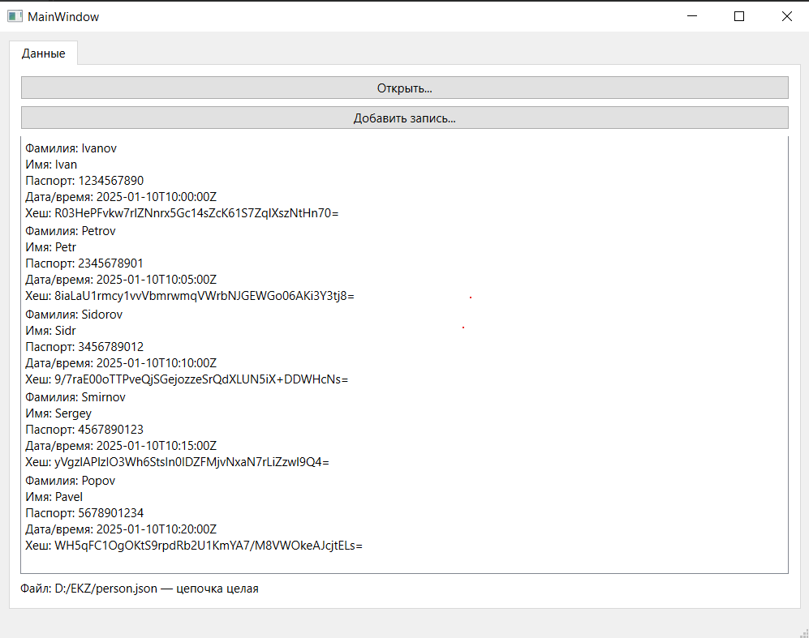
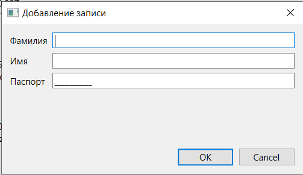

# 211_331_Sokolov

## Описание проекта

Данное приложение реализует систему хранения и проверки целостности массива персональных данных 
на основе цепочки криптографических хешей. Каждая запись содержит фамилию, имя, номер паспорта, 
дату и время создания, а также хеш SHA-256 в формате base64. Хеш вычисляется по формуле:

hash = SHA256( surname + name + passport + createdAt + previousHash )

Таким образом формируется «цепочка» зависимых друг от друга записей: изменение данных 
в середине файла приводит к нарушению всей последующей последовательности. Программа 
автоматически считывает данные из JSON-файла, проверяет корректность цепочки, выделяет 
повреждённые записи красным цветом и отображает статус проверки. Также поддерживается добавление 
новых записей через специальный диалог: дата, время и хеш генерируются автоматически без участия 
пользователя.

## Функциональные возможности

- Загрузка JSON-файла с массивом записей.
- Проверка хеш-цепочки и выделение некорректных элементов.
- Отображение всех полей записи в `QListWidget`.
- Кнопка **Открыть** для выбора любого файла данных.
- Кнопка **Добавить запись.**:
  - ввод ФИО и паспорта,
  - автоматическая генерация даты/времени,
  - автоматический расчёт хеша по формуле.

## Скриншоты интерфейса

### Основное окно

### Диалог добавления записи

